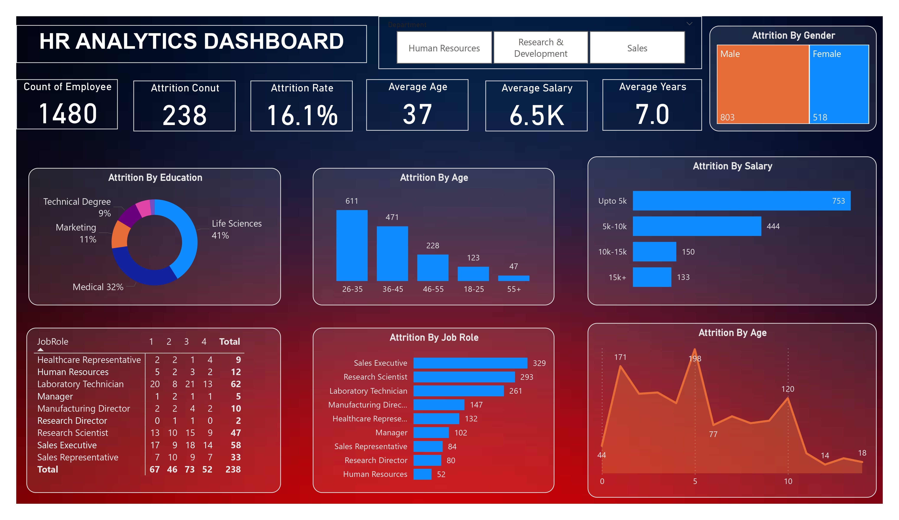

# HR Analytics Dashboard - Power BI Project



## 📊 Overview

This is an **HR Analytics Dashboard** developed using **Microsoft Power BI**. The dashboard provides visual insights into employee attrition trends to help HR departments make informed decisions.

## 🧾 Key Features

- **Total Employees**: 1480  
- **Attrition Count**: 238  
- **Attrition Rate**: 16.1%  
- **Average Age**: 37  
- **Average Salary**: $6.5K  
- **Average Tenure**: 7 Years

### Visualizations Included:

- 📊 Attrition by Age
- 👩‍🎓 Attrition by Education
- 💼 Attrition by Job Role
- 💰 Attrition by Salary Bracket
- 👨‍👩‍👧‍👦 Attrition by Gender
- 🏢 Department Filters

## 📁 Project Files

- `HR_Analytics.xlsx` — **Dataset used** for this project.
- `HR_pages-to-jpg-0001.jpg` — Snapshot of the Power BI dashboard.
- `HR_Analytics.pbix` *(Optional)* — Power BI project file. *(Upload if you'd like to share the interactive file)*

## 🔧 Tools Used

- **Power BI Desktop**
- **Excel (.xlsx)** for data preparation and storage

## 🚀 Getting Started

1. Clone this repository:
   ```bash
   git clone https://github.com/your-username/hr-analytics-powerbi.git
   ```
2. Open HR_Analytics.pbix using Power BI Desktop (if provided).
3. Load or connect the dataset: HR_Analytics.xlsx
4. Refresh data and interact with the dashboard.

## 📊 Data Insights

- Age 26–35 group has the highest attrition.
- Most attrition comes from employees in Life Sciences and Medical fields.
- Sales Executives and Research Scientists see the highest turnover.
- Employees earning less than $5K have the highest attrition rates.

## 📌 Notes

- This dashboard was built for educational and analytical purposes using dummy/synthetic HR data.
- Ensure Power BI Desktop is installed to view the .pbix file.

## 📬 Contact

- For feedback or questions, open an issue or email at [saivarshith1085@gmail.com].
